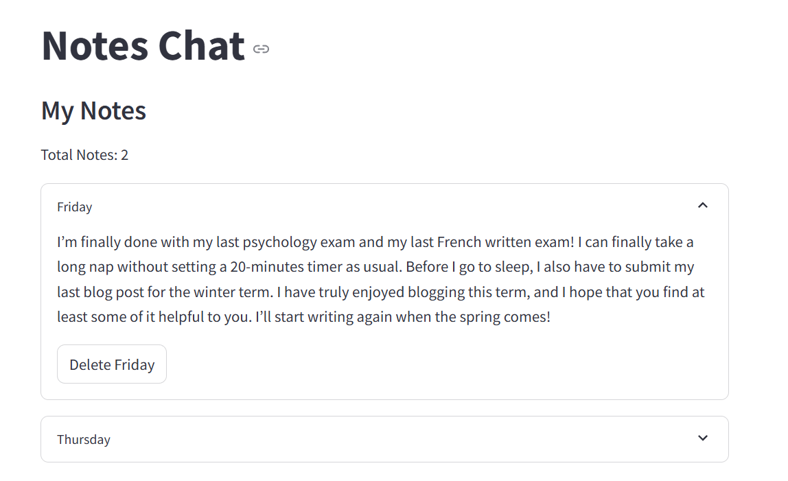
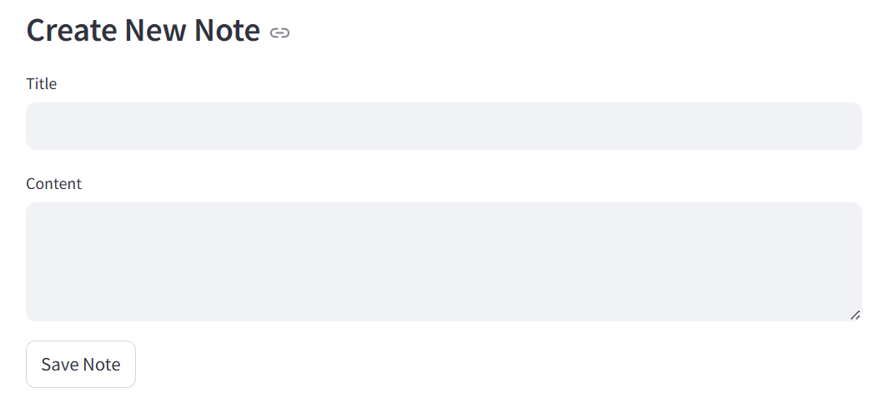
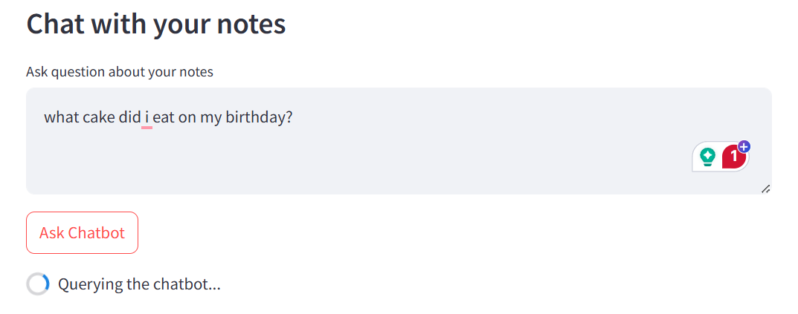
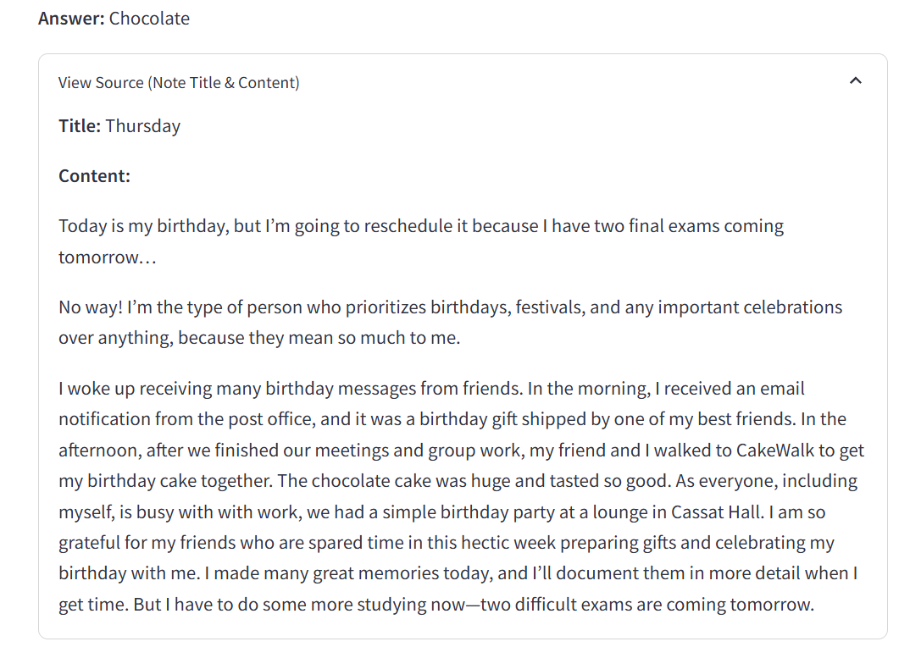

# Notes RAG Chatbot

## Overview

This project is a notes-taking website combined with a Retrieval-Augmented Generation (RAG) model for a chatbot. The chatbot utilizes the Google flan-t5 model from Hugging Face to answer questions about the notes stored in the Pinecone vector database. The project is powered by a REST API built using **FastAPI**, and the front-end is developed using **Streamlit**. The entire application is Dockerized, pushed to GitHub Actions, and deployed to AWS App Runner.

---

## Features

- **Notes Management**: Create, read, update, and delete notes through a user-friendly interface.
- **Chatbot**: Ask questions about your notes and get answers using the flan-T5 model from Hugging Face.
- **Database Integration**: Notes are stored and retrieved from a Pinecone vector database.
- **REST API**: FastAPI is used to handle backend operations, including communication with the database and the model.
- **Streamlit UI**: A simple UI built with Streamlit that allows users to interact with the chatbot and manage notes.
- **Dockerized**: The application is containerized using Docker for easy deployment.
- **CI/CD**: The project is integrated with GitHub Actions for automatic testing, building, and pushing Docker images to AWS ECR.

---

## Technologies Used

- **Backend**:

  - FastAPI (for REST API operations)
  - flan-T5 from Hugging Face (for RAG chatbot)
  - Pinecone (for storing notes in a vector database)

- **Frontend**:

  - Streamlit (for building the user interface)

- **Deployment**:
  - Docker (for containerization)
  - GitHub Actions (for CI/CD automation)
  - AWS ECR (for storing Docker images)
  - AWS App Runner (for deployment)

## Screenshots

---
